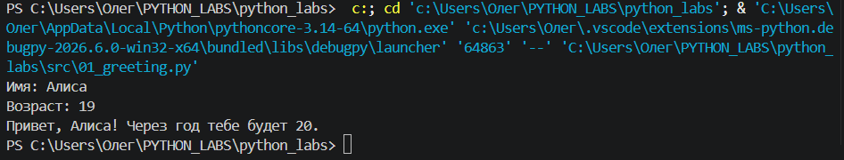
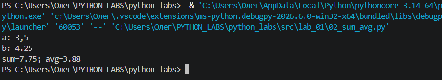
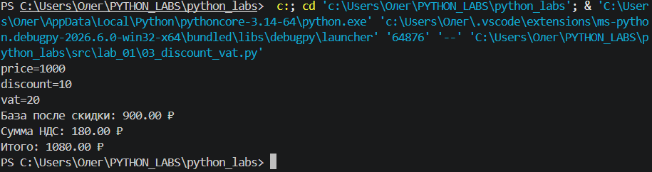
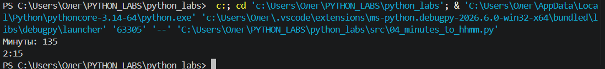
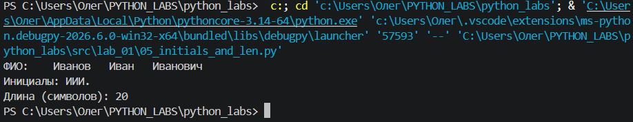
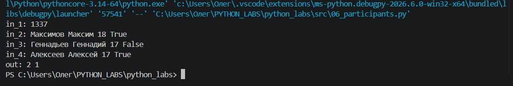
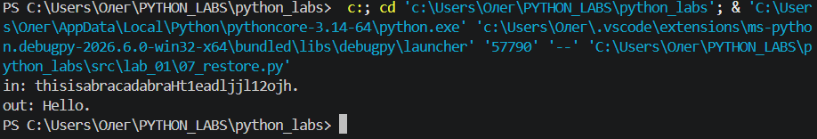
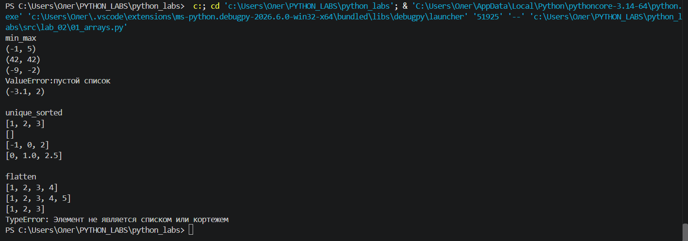
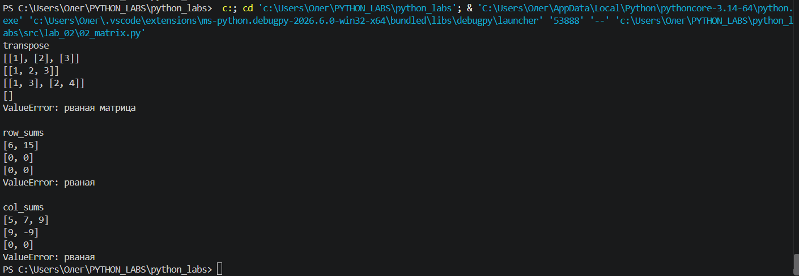

# Лабораторная работа 1

# Задание 1
```
name = input("Имя: ")
age = int(input("Возраст: "))
print("Привет, ", name, "! Через год тебе будет ", age + 1,'.',sep='')
```

# Задание 2
```
a=float(input('a: ').replace(',','.'))
b=float(input('b: ').replace(',','.'))
summa=a+b
sr=(a+b)/2
print(f'sum={summa:.2f}; avg={sr:.2f}')
```

# Задание 3
```
price=float(input('price='))
discount=float(input('discount='))
vat=float(input('vat='))
base = price * (1 - discount/100)
vat_amount = base * (vat/100)
total = base + vat_amount
print(f'База после скидки: {base:.2f} ₽')
print(f'Сумма НДС: {vat_amount:.2f} ₽')
print(f'Итого: {total:.2f} ₽')
```

# Задание 4
```
m = int(input("Минуты: "))

hours = m // 60
minutes = m % 60

print(f"{hours}:{minutes:02d}")
```

# Задание 5
```
s=input('ФИО: ')
a=s.split()
print(f'Инициалы: {a[0][0]+a[1][0]+a[2][0]}.')
print(f'Длина (символов): {len(a[0])+len(a[1])+len(a[2])+2}') #+2 пробела между именем фамилией/ именем отчеством
```


# Задание 6
```
n=int(input('in_1: '))
o=0
z=0
for i in range(n):
    s=input(f'in_{i+2}: ').split()
    if s[3]=='True':
        o+=1
    else:
        z+=1
    if o+z==3:
        print('out:',o, z)
        break
```

# Задание 7
```
s=input('in:')
first=0
for i in range(len(s)):
    if s[i].isupper():
        first=i
        break
sec=0
for i in range(first,len(s)):
    if s[i].isdigit():
        sec=i+1
        break
shag=sec-first
res=''
for i in range(first,len(s),shag):
    res+=s[i]
    if s[i]=='.':
        break
print('out:',res)
```


# Лабораторная работа 2

# Задание 1
```
def min_max(nums: list[float | int]) -> tuple[float | int, float | int]:
    if not nums:
        raise ValueError
    
    min_val, max_val = nums[0], nums[0]
    for num in nums:
        if num < min_val: min_val = num
        if num > max_val: max_val = num
    return (min_val, max_val)

def unique_sorted(nums: list[float | int]) -> list[float | int]:
    if not nums: return []
    result = []
    for item in nums:
        if item not in result:
            result.append(item)
    length = len(result)
    for i in range(length):
        for j in range(0, length - i - 1):
            if result[j] > result[j + 1]:
                result[j], result[j + 1] = result[j + 1], result[j]
    return result

def flatten(mat: list[list | tuple]) -> list:
    flat_list = []
    for sublist in mat:
        if not isinstance(sublist, (list, tuple)):
            raise TypeError("строка не строка строк матрицы")
        for element in sublist:
            flat_list.append(element)
    return flat_list

print("min_max")
print(min_max([3, -1, 5, 5, 0]))                 
print(min_max([42]))                             
print(min_max([-5, -2, -9]))
try:
    print(min_max([]))
except ValueError:
    print("ValueError")
print(min_max([1.5, 2, 2.0, -3.1]))              

print("\nunique_sorted")
print(unique_sorted([3, 1, 2, 1, 3]))      
print(unique_sorted([]))    
print(unique_sorted([-1, -1, 0, 2, 2]))    
print(unique_sorted([1.0, 1, 2.5, 2.5, 0]))

print("\nflatten")
print(flatten([[1, 2], [3, 4]]))                 
print(flatten([[1, 2], (3, 4, 5)]))              
print(flatten([[1], [], [2, 3]]))
try:
    print(flatten([[1, 2], "ab"]))
except TypeError as e:
    print(f"TypeError: {e}")
```



# Задание 2
```
def transpose(mat: list[list[float | int]]) -> list[list]:
    """
    Поменять строки и столбцы местами. Пустая матрица [] -> [].
    Если матрица «рваная» (строки разной длины) — ValueError.
    """
    if not mat:
        return []
    cols = len(mat[0])
    for row in mat:
        if len(row) != cols:
            raise ValueError("рваная матрица")
            
    result = []
    for j in range(cols):
        new_row = []
        for i in range(len(mat)):
            new_row.append(mat[i][j])
        result.append(new_row)
    return result

def row_sums(mat: list[list[float | int]]) -> list[float]:
    """
    Сумма по каждой строке. Требуется прямоугольность (см. выше).
    """
    if not mat:
        return []
    cols = len(mat[0])
    sums = []
    for row in mat:
        if len(row) != cols:
            raise ValueError("рваная")
        current_sum = 0
        for num in row:
            current_sum += num
        sums.append(current_sum)
    return sums

def col_sums(mat: list[list[float | int]]) -> list[float]:
    """
    Сумма по каждому столбцу. Требуется прямоугольность.
    """
    if not mat:
        return []
    cols = len(mat[0])
    for row in mat:
        if len(row) != cols:
            raise ValueError("рваная")
            
    sums = [0] * cols
    for row in mat:
        for j in range(cols):
            sums[j] += row[j]
    return sums

print("transpose")
print(transpose([[1, 2, 3]]))
print(transpose([[1], [2], [3]]))
print(transpose([[1, 2], [3, 4]]))
print(transpose([]))
try:
    print(transpose([[1, 2], [3]]))
except ValueError as e:
    print(f"ValueError: {e}")

print("\nrow_sums")
print(row_sums([[1, 2, 3], [4, 5, 6]]))
print(row_sums([[-1, 1], [10, -10]]))
print(row_sums([[0, 0], [0, 0]]))
try:
    print(row_sums([[1, 2], [3]]))
except ValueError as e:
    print(f"ValueError: {e}")

print("\ncol_sums")
print(col_sums([[1, 2, 3], [4, 5, 6]]))
print(col_sums([[-1, 1], [10, -10]]))
print(col_sums([[0, 0], [0, 0]]))
try:
    print(col_sums([[1, 2], [3]]))
except ValueError as e:
    print(f"ValueError: {e}")
```

